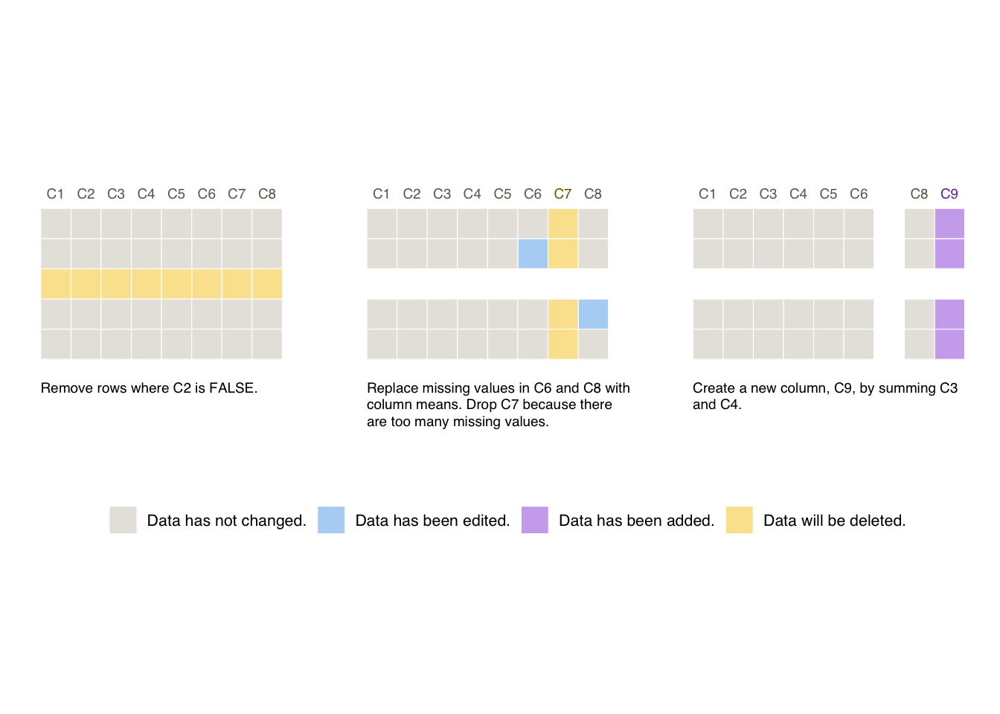

<!-- badges: start -->
[](https://CRAN.R-project.org/package=smallsets)
<!-- badges: end -->

**`smallsets` website: [lydialucchesi.github.io/smallsets/](https://lydialucchesi.github.io/smallsets/)**

Do you use R or Python to preprocess datasets for analyses? `smallsets` is an R package (https://CRAN.R-project.org/package=smallsets) that transforms the preprocessing code in your R, R Markdown, or Python script into a Smallset Timeline, a simple visualisation of preprocessing decisions. A full description of the Smallset Timeline can be found in the paper [**Smallset Timelines: A Visual Representation of Data Preprocessing Decisions**](https://dl.acm.org/doi/abs/10.1145/3531146.3533175) in the proceedings of ACM FAccT '22. A short ([3 min](https://www.youtube.com/watch?v=_fpn02h3IUo)) and long ([15 min](https://www.youtube.com/watch?v=I_ksOv6rj1Y)) YouTube video provide an introduction to the project.

The `smallsets` user guide is available [here](https://lydialucchesi.github.io/smallsets/articles/smallsets.html) and in the package in `vignette("smallsets")`. If you have questions or would like help building a Smallset Timeline, please email Lydia at lydia.lucchesi@anu.edu.au.

## Install from CRAN

```{r, eval=FALSE}
install.packages("smallsets")
```

## Quick start example

Run this snippet of code to build your first Smallset Timeline! It's based on the synthetic dataset s_data, with 100 observations and eight variables (C1-C8), and the preprocessing script s_data_preprocess.R, discussed in the following section.

```{r quick-start-example, eval=FALSE}
library(smallsets)

set.seed(145)

Smallset_Timeline(data = s_data,
                  code = system.file("s_data_preprocess.R", package = "smallsets"))
```



## Structured comments

The Smallset Timeline above is based on the R preprocessing script below, s_data_preprocess.R. Structured comments were added to it, informing `smallsets` what to do.

```{r, code=readLines(system.file("s_data_preprocess.R", package="smallsets")), eval=FALSE, class.source="view-only"}
```

## Citing `smallsets`

If you use the `smallsets` software, please cite the Smallset Timeline paper.

Lydia R. Lucchesi, Petra M. Kuhnert, Jenny L. Davis, and Lexing Xie. 2022. Smallset Timelines: A Visual Representation of Data Preprocessing Decisions. In 2022 ACM Conference on Fairness, Accountability, and Transparency (FAccT '22). Association for Computing Machinery, New York, NY, USA, 1136–1153. https://doi.org/10.1145/3531146.3533175

```
@inproceedings{smallsets2022, 
author = {Lucchesi, Lydia R. and Kuhnert, Petra M. and Davis, Jenny L. and Xie, Lexing}, 
title = {Smallset Timelines: A Visual Representation of Data Preprocessing Decisions}, 
year = {2022}, 
isbn = {9781450393522}, 
publisher = {Association for Computing Machinery}, 
address = {New York, NY, USA}, 
url = {https://doi.org/10.1145/3531146.3533175}, 
doi = {10.1145/3531146.3533175}, 
location = {Seoul, Republic of Korea}, 
series = {FAccT '22}
}
```