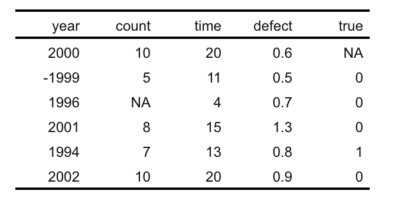
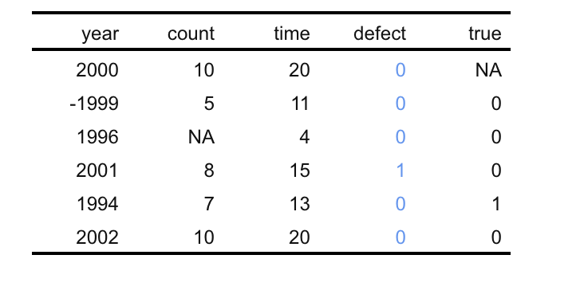
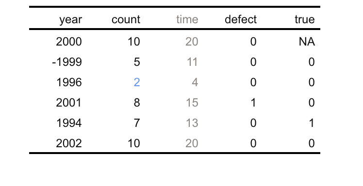
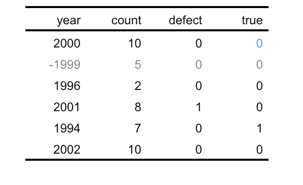
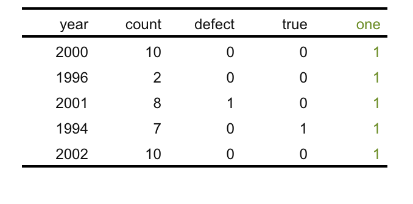
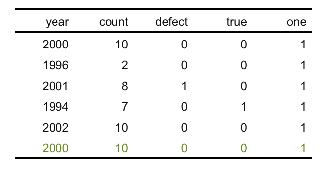
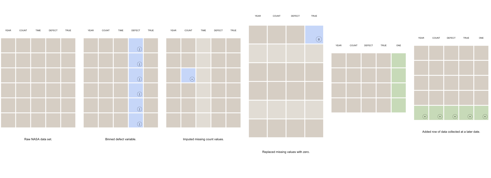
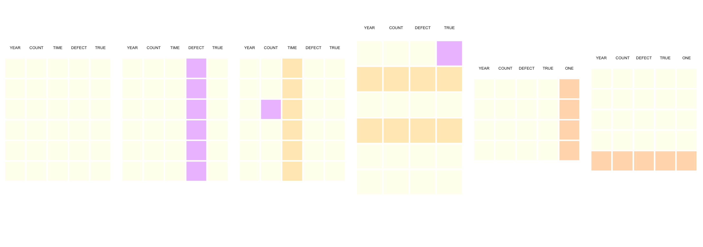

## Overview of package idea

As someone types out their preprocessing code, this R package can be used to create a (visual) toy example of what is happening, step-by-step, in the preprocessing stages of the pipeline. The R package would be designed in such a way that additional coding on top of the original preprocessing code would be minimal. The package output can be used later as a reference for researchers to better understand what is happening in the code. But the package also creates a “publishable/shareable” version of this as well, that can offer data privacy if needed, and offers a simple but visual and ordered view of the preprocessing, with a text component below (this is where I imagine affordance/impact statements, references to theory, important quotes related to extraction context, etc.), and on top of the processing toy plots, possibly what I call “justification plots,” so another simple plot that helps clarify your decision to do what you did - i.e., maybe a Meng bias plot or a plot to show correlation between two variables. [Here](https://github.com/lydialucchesi/smallset/blob/main/other_code/scratch/test.pdf) is a very simple example that I hard-coded in R, and it is roughly based on this [paper](https://ieeexplore.ieee.org/document/6353339) looking at preprocessing of the NASA software defect data sets that have been used extensively in research and preprocessed different ways throughout the body of literature. The real timeline visual for the NASA example would look different. I haven’t fully fleshed out the statements below the plots, nor have I added any “justification plots.” I am not aware of anything like this in R.

That visual is an example of the “shareable” view respecting data privacy. Each gray dot is a data point, and this is a small subset of the rows and columns (important columns included). In the “researcher” view, you’d actually see example data points from the data set, and there would be visual cues to signal what change to the structure/data is occurring.

The R package would know how to choose an appropriate subset that includes examples of the preprocessing, and then be able to apply what is happening in the actual preprocessing code to this little subset and create an appropriate visual representation. Something like that.

The R package would produce this preprocessing timeline toy example with very little additional coding from the researcher (they have to define a few things in the beginning), but then the package is really good at interpreting what is going on in the actual preprocessing code and applying it to this comprehensive (in terms of data preprocessing issues/things that need to be adjusted) toy subset and representing it visually for easy comprehension. Writing out the statements below each step and creating additional justification plots would be up to the coder, but we would offer tools for doing so. The idea is that it offers benefits to both the coder and the end user. For the coder… documentation and little visual cues of what is happening in the code (for when you forget or pass it along to someone else to use) and an easy tool to use for communication with end users. For the end user… well it is better than being referred to a code repository to sift through and might aid in understanding alongside text, giving them the ability to assess the researchers decisions.

## Explanation of code so far

To start, I wanted to see if I could apply preprocessing steps to a subset based solely on comments added to the original data preprocessing script. The output is a bunch of snapshots from the preprocessing stage, capturing the structure of the data frame and state of the data at different points along the way. So far, here is the code I've come up with.

First, I generated a simple little data set.

```{r, echo = TRUE, eval = FALSE}
source("gen_data.R")

df
```

Then I created a script with some preprocessing steps. This script is called `prep_data.R`. See the contents of it below. The commenting is how you tell the R package where the preprocessing code starts and ends and where you want to capture the current state of the data for inclusion in the preprocessing timeline.

You specify the start with `# start smallset` and end with `# end smallset`.
You tell it to take a snapshot with `# snap [name of data frame at that time]`. This is placed above the line of code that it will take the snapshot after.

```{r, echo = TRUE, eval = FALSE}

source("gen_data.R")
plot(df$count, df$time)

# start smallset
# snap df
df$defect <- ifelse(df$defect > 1, 1, 0)
model <- lm(count ~ time, data = df)
# snap df
df$count <- round(ifelse(is.na(df$count), predict(model, df), df$count))
df$time <- NULL
# snap df
df[is.na(df)] <- 0
prepped <- subset(df, year > 0)
# snap prepped
# end smallset
```

Next I wrote a script called `write_smallset_code.R` (see below). It would be an internal script in the package. It imports the text of the preprocessing code; figures out where the preprocessing starts and ends; adds in lines to tell R when to save a "snapshot" to a list of snapshots; turns the entire thing into a function; and then outputs an R script called `smallset_code.R` so that it can be sourced and applied to the smaller subset later.

```{r, echo = TRUE, eval = FALSE}

library(stringr)

writeSmallsetCode <- function(scriptName) {
  
  processTXT <- as.data.frame(readLines(scriptName))
  colnames(processTXT) <- c("command")
  processTXT$command <- as.character(processTXT$command)
  
  rStart <-
    row.names(processTXT)[processTXT$command == "# start smallset"]
  rEnd <-
    row.names(processTXT)[processTXT$command == "# end smallset"]
  
  smallsetCode <-
    processTXT[(as.numeric(rStart) + 1):(as.numeric(rEnd) - 1),]
  
  smallsetCode <- data.frame(command = smallsetCode)
  smallsetCode$command <- as.character(smallsetCode$command)
  
  iterLim <-
    nrow(smallsetCode) + nrow(subset(smallsetCode, grepl("# snap ", smallsetCode$command))) - 1
  s = 0
  for (i in 1:iterLim) {
    signal <- "# snap "
    if (grepl(signal, smallsetCode$command[i])) {
      s <- s + 1
      
      insertSnap <- c(paste0(
        "snapshots[[",
        as.character(s),
        "]] <- ",
        as.character(str_remove(smallsetCode$command[i], signal))
      ))
      
      if (i != iterLim) {
        smallsetCode <- c(smallsetCode[1:(i + 1),],
                          insertSnap,
                          smallsetCode[(i + 2):nrow(smallsetCode),])
      } else {
        smallsetCode <- c(smallsetCode[1:i,],
                          insertSnap,
                          "return(snapshots)")
      }
      
      smallsetCode <- data.frame(command = smallsetCode)
      smallsetCode$command <- as.character(smallsetCode$command)
    }
  }
  
  initialName <-
    as.character(str_remove(subset(
      smallsetCode, grepl("# snap ", smallsetCode$command)
    )[1,], "# snap "))
  functionStart <-
    paste0("applyCode <- function(", initialName, ") {")
  smallsetCode <-
    c("snapshots <- list()",
      functionStart,
      smallsetCode$command,
      "}")
  smallsetCode <- data.frame(command = smallsetCode)
  smallsetCode$command <- as.character(smallsetCode$command)
  
  fileConn <- file("smallset_code.R")
  writeLines(smallsetCode$command, fileConn)
  close(fileConn)
  
}

writeSmallsetCode("prep_data.R")

```

All the user needs to do is pass a data frame and the name of the preprocessing script (with proper comments) to the function called `prep_smallset()` located in the `apply_smallset_code.R` script.

```{r, echo = TRUE, eval = FALSE}

source("gen_data.R")

prep_smallset <- function(data, prepCode) {
  
  smallset <- head(data)
  
  source("write_smallset_code.R")
  writeSmallsetCode(scriptName = prepCode)
  
  source("smallset_code.R")
  smallsetList <- applyCode(smallset)
  
  return(smallsetList)
  
}

prepList <- prep_smallset(data = df, prepCode = "prep_data.R")

prepList

```

The next steps: (1) figure out how to get a good subset of the data that includes representations of all preprocessing steps (currently just taking the first six rows of the data set) and (2) figure out how to attach the proper visualisations to these different steps.

## Update 21/10/2020

Today I added a function to generate a smallset and wrote a function that highlights changes (with colour) in a data frame throughout the preprocessing.

Below is the `select_smallset.R` function.

```{r, echo = TRUE, eval = FALSE}
library(dplyr)

# should there be a minimum size of a smallset?
# add error: size cannot be less than rowNums
# add error: size cannot be greater than size of data
# add error: rowNums has to be a numeric vector
# should there be a maximum size of a smallset?

select_smallset <- function(data,
                            size = 6,
                            rowNums = NULL) {
  if (is.null(rowNums)) {
    smallset <- sample_n(data, size = size)
  }
  
  if (!is.null(rowNums)) {
    smallset <- rbind(data[rowNums, ],
                      sample_n(data[-rowNums, ], size = (size - length(rowNums))))
  }
  
  rownames(smallset) <- seq(1, nrow(smallset), 1)
  return(smallset)
}
```

Below is the `highlight_changes.R` function.

```{r, echo = TRUE, eval = FALSE}
library(flextable)

# highlight what you will lose (rows and columns) (prior to it happening because once it is gone you can't see it)
# default colour is gray
# highlight what is now changed (cells in data frame)
# default is cornflower blue
# highlight what has been added (rows or columns)
# default colour is olive green

highlight_changes <- function(list) {
  tables <- list()
  for (p in 1:(length(list) - 1)) {
    c <- p + 1
    
    lprior <- list[[p]]
    lcurrent <- list[[c]]
    
    if (p > 1) {
      tprior <- tables[[p]]
    } else {
      tprior <- flextable(lprior)
    }
    
    tcurrent <- flextable(lcurrent)
    
    rowsDrop <- setdiff(rownames(lprior), rownames(lcurrent))
    if (length(rowsDrop) > 0) {
      tprior <- color(tprior, color = "seashell4", i = rowsDrop)
    }
    
    rowsAdd <- setdiff(rownames(lcurrent), rownames(lprior))
    if (length(rowsAdd) > 0) {
      tcurrent <-
        color(tcurrent, color = "olivedrab4", i = rowsAdd)
    }
    
    colsDrop <- setdiff(colnames(lprior), colnames(lcurrent))
    if (length(colsDrop) > 0) {
      tprior <-
        color(tprior,
              color = "seashell4",
              j = colsDrop,
              part = "all")
    }
    
    colsAdd <- setdiff(colnames(lcurrent), colnames(lprior))
    if (length(colsAdd) > 0) {
      tcurrent <-
        color(tcurrent,
              color = "olivedrab4",
              j = colsAdd,
              part = "all")
    }
    
    if (length(rowsDrop) > 0) {
      lpriorAdj <- subset(lprior,!(row.names(lprior) %in% rowsDrop))
    } else {
      lpriorAdj <- lprior
    }
    
    if (length(colsAdd) > 0) {
      lcurrentAdj <- subset(lcurrent, select = colnames(lprior))
    } else {
      lcurrentAdj <- lcurrent
    }
    
    original <-
      setdiff(subset(lpriorAdj, select = colnames(lcurrentAdj)), lcurrentAdj)
    update <-
      setdiff(lcurrentAdj, subset(lpriorAdj, select = colnames(lcurrentAdj)))
    
    adjData <- data.frame(r = numeric(), c = numeric())
    for (i in 1:nrow(original)) {
      for (j in 1:ncol(original)) {
        if (identical(original[i, j], update[i, j]) == FALSE) {
          adjDatum <- data.frame(r = c(row.names(update)[i]), c = c(j))
          adjData <- rbind(adjData, adjDatum)
        }
      }
    }
    
    adjData$r <- as.integer(as.character(adjData$r))
    tcurrent <-
      color(tcurrent,
            color = "cornflowerblue",
            i = adjData$r,
            j = adjData$c)
    
    tables[[p]] <- tprior
    tables[[c]] <- tcurrent
    
  }
  
  
  return(tables)
}

```

The user needs to add comments to their preprocessing script, run the `prep_smallset.R` code, and then run the `highlight_changes.R` command to get data frames with colour-coded changes.

Here is an example of what the preprocessing script might look like.

```{r, echo = TRUE, eval = FALSE}
source("gen_data.R")
plot(df$count, df$time)

# start smallset
# snap df
df$defect <- ifelse(df$defect > 1, 1, 0)
model <- lm(count ~ time, data = df)
# snap df
df$count <- round(ifelse(is.na(df$count), predict(model, df), df$count))
df$time <- NULL
# snap df
df[is.na(df)] <- 0
prepped <- subset(df, year > 0)
# snap prepped
prepped$one <- 1
newRow <- prepped[1, ]
prepped <- rbind(prepped, newRow)
# snap prepped
# end smallset
```

And the commands they need to run are as follows. The size argument corresponds to the size of the smallset, and the rowNums argument allows one to specify certain rows from the original data frame that they would like included in the smallset.

```{r, echo = TRUE, eval = FALSE, warning = FALSE, message = FALSE}
source("gen_data.R")
source("apply_smallset_code.R")
source("highlight_changes.R")

mylist <-
  prep_smallset(
    data = df,
    prepCode = "prep_data.R",
    rowCount = 6,
    rowNums = c(1, 2, 5)
  )

fts <- highlight_changes(list = mylist)
```

Below is the output from `hightlight_changes.R`.

The colour gray signals that a row or column is about to be dropped. Blue means that the cell has a new data value in it compared to the last snapshot. And green means a row or column has been added. It's all meant to be really easy for the user, and the idea is that they don't have to do that much more work than they already are for the data prep stages... so far, all they really have to do is add comments to their preprocessing script and they can get the output below (this is what is in the fts object created above).








Next steps are to add in a few customization options, make it so that one can include additional visual cues, and figure out how to abstract the data to symbols. Also, plotting this out in a timeline and adding impact statements below and justification plots above. Need to run some additional testing and investigate the warning I am getting from the readLines function.

Need to figure out how to subset/select columns for the smallset. Currently, the smallset includes all of the columns in the original data frame.

## UPDATE: 29 OCTOBER 2020

I have designed a visual abstraction of the smallset and how one will add timeline captions and additional visual cues.

```{r, echo = TRUE, eval = FALSE, warning = FALSE, message = FALSE}
library(ggpubr)

source("gen_data.R")
source("apply_smallset_code.R")
source("highlight_changes.R")
source("abstract_it.R")


mylist <-
  prep_smallset(
    data = df,
    prepCode = "prep_data.R",
    rowCount = 6,
    rowNums = c(1, 2, 5)
  )

fts <- highlight_changes(list = mylist, captionScript = "mycaptions")
check <- abstract_it(ftsList = fts)
ggarrange(check[[1]], check[[2]], check[[3]], check[[4]], check[[5]], check[[6]],
          nrow = 1)
```



Now when you run `highlight_changes` a caption and symbol template is generated. It corresponds with the snap points defined in the preprocessing script. It looks like [this](https://github.com/lydialucchesi/smallset/tree/master/mycaptions.Rmd). The user populates this and then runs the `abstract_it()` function to get a preprocessing smallset timeline. If you don't add an additional symbol in the template, then there is no circle in the final visual - just colour that signals some type of adjustment to the data set. Here is an example of a filled-out caption form: (link now broken).

You can also change the colours.

```{r, echo = TRUE, eval = FALSE, warning = FALSE, message = FALSE}
library(ggpubr)

source("gen_data.R")
source("apply_smallset_code.R")
source("highlight_changes.R")
source("abstract_it.R")

mylist <-
  prep_smallset(
    data = df,
    prepCode = "prep_data.R",
    rowCount = 6,
    rowNums = c(1, 2, 5)
  )

fts <- highlight_changes(list = mylist, captionScript = "mycaptions2", constant = "lemonchiffon", changed = "darkorchid1", added = "darkorange", deleted = "goldenrod1")
check <- abstract_it(ftsList = fts)
ggarrange(check[[1]], check[[2]], check[[3]], check[[4]], check[[5]], check[[6]],
          nrow = 1)
```



## Notes - 2 November 2020

smallset is now organized as an R package.

```{r, eval = FALSE, echo = TRUE}
library(smallset)

mylist <- prep_smallset(data = df, 
                        prepCode = "other_code/prep_data.R", 
                        rowCount = 6, 
                        rowNums = c(1, 2, 5))

fts <- highlight_changes(list = mylist, 
                         captionScript = "mycaptions", 
                         constant = "seashell4", 
                         changed = "darkorchid1", 
                         added = "darkorange", 
                         deleted = "goldenrod1")

check <- abstract_timeline(ftsList = fts, sizing =
                             list(
                               "columns" = 2,
                               "tiles" = 1,
                               "captions" = 10
                             ))

library(cowplot)
plot_grid(plotlist = check, nrow = 1)
```

### To-do list:

* Add option to "hide" sections in the prep code
  * Is there a better word than hide?
* Work on methodology for sampling of a smallset
  * Need it to be representative/unbiased but also comprehensive in terms of issues/adjustments addressed in the preprocessing step
    * How do you balance this in a smallset
  * Figure out how to select columns for smallset - this will be tricky because of smallset_code script
* Design decision/action stamps that can be added to tiles to further specify what is happening to the data at that point
  * Add up over time? Or only visible at one point on timeline. I think this should be an optional feature
  * Add option to choose location of these inside a tile
  * Design a series of pre-made ones to choose from - square shaped?
    * Imputing
    * Binning
    * Outlier-ing
    * Standardising
    * Converting units
    * Subsetting/filtering
    * Aggregating/disaggrating
    * Transforming
    * Merging
    * Removing implausible/erroneous values
    * Rearranging
    * Dropping
  * Offer build your own option - should this be what I already have with the circles and symbols? Probably a better method - will see if stamps turn out first
* Get tiles to be equal size across entire timeline
  * Then write a viewing/plotting function for the timeline
* Create option to rename caption template file so it is not written over when you rerun highlight_changes()
* Explore colour overlays for tile colours
* Add option to abstract column names
* Comment code and write tests
* Create a colour key for timeline
* Debug issue with prep_data2 script
  * Do I need to attach an id to each data cell?
* Create mtcars data extraction example with captions - include quotes from Motor Trends magazine articles
* Think about adding *timeline analysis* tools to the package
* Think about case studies and examples
  * Different approaches to caption narration: first person vs. third person and past tense vs. present tense


