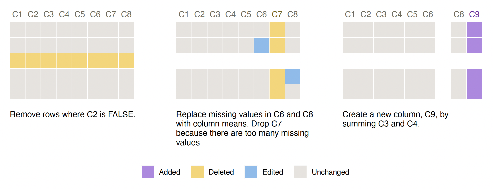

# smallsets: Visual Documentation for Data Preprocessing in R and Python

[](https://CRAN.R-project.org/package=smallsets)


**`smallsets` website:
[lydialucchesi.github.io/smallsets/](https://lydialucchesi.github.io/smallsets/)**

Do you use R or Python to preprocess datasets for analyses? `smallsets`
is an R package (<https://CRAN.R-project.org/package=smallsets>) that
transforms the preprocessing code in your R, R Markdown, Python, or
Jupyter Notebook file into a Smallset Timeline. A Smallset Timeline is a
static, compact visualisation composed of small data snapshots of
different preprocessing steps. A full description of the Smallset
Timeline can be found in the paper [**Smallset Timelines: A Visual
Representation of Data Preprocessing
Decisions**](https://doi.org/10.1145/3531146.3533175) in the proceedings
of ACM FAccT ’22. A short ([3
min](https://www.youtube.com/watch?v=_fpn02h3IUo)) and long ([15
min](https://www.youtube.com/watch?v=I_ksOv6rj1Y)) YouTube video provide
an introduction to the project.

The `smallsets` user guide is available
[here](https://lydialucchesi.github.io/smallsets/articles/smallsets.html)
and in the package in `vignette("smallsets")`. If you have questions or
would like help building a Smallset Timeline, please [email
Lydia](mailto:lydia.lucchesi@anu.edu.au).

**[Download the smallsets cheatsheet (1-page
PDF)](https://lydialucchesi.github.io/smallsets_cheatsheet/smallsets_cheatsheet.pdf)**

## Install from CRAN

``` r
install.packages("smallsets")
```

## Quick start example

Run this snippet of code to build your first Smallset Timeline! It’s
based on the synthetic dataset s_data, with 100 observations and eight
variables (C1-C8), and the preprocessing script s_data_preprocess.R,
discussed in the following section.

``` r
library(smallsets)

set.seed(145)

Smallset_Timeline(data = s_data,
                  code = system.file("s_data_preprocess.R", package = "smallsets"))
```



## Structured comments

The Smallset Timeline above is based on the R preprocessing script
below, s_data_preprocess.R. Structured comments were added to it,
informing `smallsets` what to do.

``` r
# smallsets snap s_data caption[Remove rows where C2 is FALSE.]caption
s_data <- s_data[s_data$C2 == TRUE, ]

# smallsets snap +2 s_data caption[Replace missing values in C6 and C8 with
# column means. Drop C7 because there are too many missing values.]caption
s_data$C6[is.na(s_data$C6)] <- mean(s_data$C6, na.rm = TRUE)
s_data$C8[is.na(s_data$C8)] <- mean(s_data$C8, na.rm = TRUE)
s_data$C7 <- NULL

# smallsets snap +1 s_data caption[Create a new column, C9, by summing C3 and
# C4.]caption
s_data$C9 <- s_data$C3 + s_data$C4
```

## Citing `smallsets`

If you use the `smallsets` software, please cite the Smallset Timeline
paper.

Lydia R. Lucchesi, Petra M. Kuhnert, Jenny L. Davis, and Lexing Xie.
2022. Smallset Timelines: A Visual Representation of Data Preprocessing
Decisions. In 2022 ACM Conference on Fairness, Accountability, and
Transparency (FAccT ’22). Association for Computing Machinery, New York,
NY, USA, 1136–1153. <https://doi.org/10.1145/3531146.3533175>

    @inproceedings{SmallsetTimelines, 
      author = {Lucchesi, Lydia R. and Kuhnert, Petra M. and Davis, Jenny L. and Xie, Lexing}, 
      title = {Smallset Timelines: A Visual Representation of Data Preprocessing Decisions}, 
      year = {2022}, 
      isbn = {9781450393522}, 
      publisher = {Association for Computing Machinery}, 
      address = {New York, NY, USA}, 
      url = {https://doi.org/10.1145/3531146.3533175}, 
      doi = {10.1145/3531146.3533175}, 
      location = {Seoul, Republic of Korea}, 
      series = {FAccT '22}
    }
