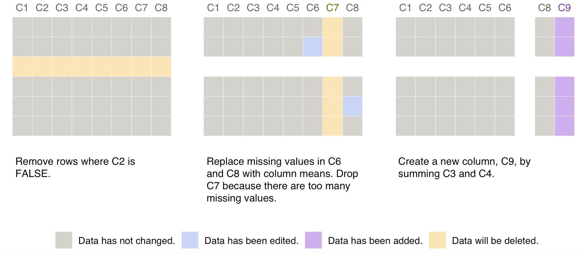

Smallset Timelines with `smallsets`
================

Welcome to the `smallsets` software repository 👋. This is the companion
repository for the paper [**Smallset Timelines: A Visual Representation
of Data Preprocessing
Decisions**](https://dl.acm.org/doi/abs/10.1145/3531146.3533175) in the
proceedings of ACM FAccT ’22. A short ([3
min](https://www.youtube.com/watch?v=_fpn02h3IUo)) and long ([15
min](https://www.youtube.com/watch?v=I_ksOv6rj1Y)) YouTube video provide
an introduction to the project.

**Do you use R or Python to preprocess datasets for analyses?**
`smallsets` is an R package that transforms your R or Python
preprocessing script into a Smallset Timeline, so that you can document
and share your preprocessing decisions in a practical manner.

*If you have questions about using `smallsets` or would like help
building a Smallset Timeline, please email Lydia at
<Lydia.Lucchesi@anu.edu.au>.*

## Installation

``` r
remotes::install_github(repo = "lydialucchesi/smallsets")
```

## Quick start example

**Copy, paste, and run the snippet of code to create your first Smallset
Timeline!**

The following section shows how to select snapshot points and provide
captions with structured comments in the preprocessing script.

*See `?Smallset_Timeline` for options to customise the appearance of
your Smallset Timeline.*

``` r
library(smallsets)
set.seed(145)

Smallset_Timeline(
  data = mydata,
  code = system.file("preprocess_data.R", package = "smallsets")
  )
```



## Structured comments

The Smallset Timeline above is based on the R preprocessing script
below. Prior to building the Timeline with `Smallset_Timeline()`, a
series of structured comments were added to the preprocessing script,
informing `smallsets` what to do.

-   `# start smallset` + `data name` (e.g., “mydata”) = start tracking
    code and take the first data snapshot
-   `# snap` + `data name` = take a data snapshot after the next line of
    code
-   `# end smallset`+ `data name` = stop tracking code and take the last
    data snapshot
-   `caption[...]caption` = add this caption to the snapshot

``` r
# start smallset mydata caption[Remove rows where C2 
# is FALSE.]caption
mydata <- mydata[mydata$C2 == TRUE,]

mydata$C6[is.na(mydata$C6)] <- mean(mydata$C6, na.rm = TRUE)
# snap mydata caption[Replace missing values in C6 and 
# C8 with column means. Drop C7 because there are too many 
# missing values.]caption
mydata$C8[is.na(mydata$C8)] <- mean(mydata$C8, na.rm = TRUE)
mydata$C7 <- NULL

mydata$C9 <- mydata$C3 + mydata$C4
# end smallset mydata caption[Create a new column, 
# C9, by summing C3 and C4.]caption
```

## Citing `smallsets`

Please cite the Smallset Timeline paper if you use the `smallsets`
software.

Lydia R. Lucchesi, Petra M. Kuhnert, Jenny L. Davis, and Lexing Xie.
2022. Smallset Timelines: A Visual Representation of Data Preprocessing
Decisions. In 2022 ACM Conference on Fairness, Accountability, and
Transparency (FAccT ’22). Association for Computing Machinery, New York,
NY, USA, 1136–1153. <https://doi.org/10.1145/3531146.3533175>

    @inproceedings{smallsets2022, 
    author = {Lucchesi, Lydia R. and Kuhnert, Petra M. and Davis, Jenny L. and Xie, Lexing}, 
    title = {Smallset Timelines: A Visual Representation of Data Preprocessing Decisions}, 
    year = {2022}, 
    isbn = {9781450393522}, 
    publisher = {Association for Computing Machinery}, 
    address = {New York, NY, USA}, 
    url = {https://doi.org/10.1145/3531146.3533175}, 
    doi = {10.1145/3531146.3533175}, 
    location = {Seoul, Republic of Korea}, 
    series = {FAccT '22}
    }
