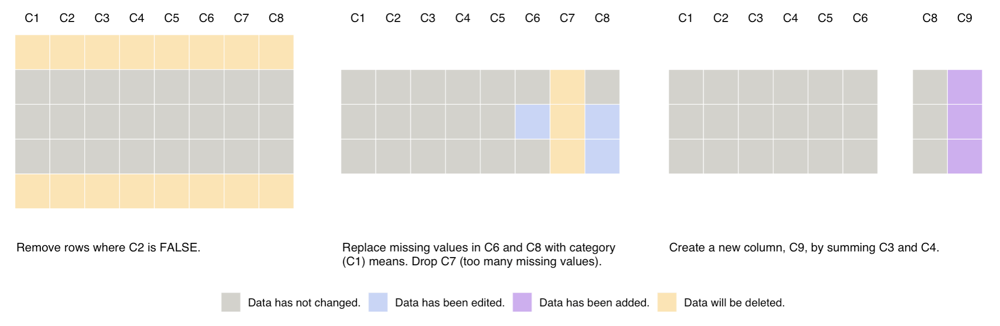
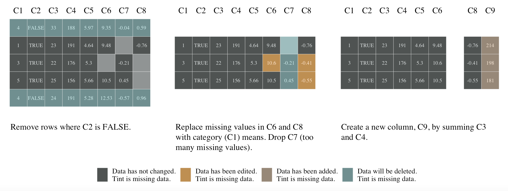

Creating Smallset Timelines with `smallsets`
================

## Introduction

Welcome to the `smallsets` software repository 👋. This is the companion
repository for the paper [**Smallset Timelines: A Visual Representation
of Data Preprocessing Decisions**](https://arxiv.org/abs/2206.04875) in
the proceedings of ACM FAccT ’22.

**Do you use R or Python to preprocess datasets for analyses?** The
Smallset Timeline is a practical visualisation to document and
communicate your data preprocessing decisions. `smallsets` is the R
package designed to make it easy to create a Smallset Timeline for your
R or Python preprocessing script.

A short ([3 min](https://www.youtube.com/watch?v=_fpn02h3IUo)) and long
([15 min](https://www.youtube.com/watch?v=I_ksOv6rj1Y)) YouTube video
provide an introduction to the research. The quick start example below
reproduces Figure 11 in [Lucchesi et
al. (2022)](https://arxiv.org/abs/2206.04875).

## Installation

``` r
remotes::install_github(repo = "lydialucchesi/smallsets")
```

## Quick start example

#### Step 1: Load software and data

Open an RStudio project and load the `smallsets` library.

``` r
library(smallsets)
```

For the quick start example, we use a synthetic dataset and
preprocessing scenario. Real-world case studies, with example Smallset
Timelines, are included in the paper.

The synthetic dataset has 100 rows and 8 columns.

``` r
data(mydata)
head(mydata)
```

#### Step 2: Add structured comments to the preprocessing script

The preprocessing for this dataset involves filtering, dealing with
missing data, and generating a new feature. Next, we add structured
`smallsets` comments to the preprocessing script.

-   `# start smallset mydata` (start tracking preprocessing code)
-   `# snap mydata` (take a snapshot of the data)
-   `# end smallset mydata` (stop tracking preprocessing code)

**You will need to copy and paste this script (comments included) into a
new R file and save it as *preprocess_mydata.R* in your working
directory.**

``` r
# start smallset mydata
mydata <- mydata[mydata$C2 == TRUE,]

mC6 <- tapply(mydata$C6, mydata$C1, function(x)
  mean(x, na.rm = TRUE))
C6sub <- as.factor(mydata$C1)
levels(C6sub) <- mC6
mydata$C6[is.na(mydata$C6)] <- round(as.numeric(levels(C6sub))[C6sub][is.na(mydata$C6)], 2)

mC8 <- tapply(mydata$C8, mydata$C1, function(x)
  mean(x, na.rm = TRUE))
C8sub <- as.factor(mydata$C1)
levels(C8sub) <- mC8
# snap mydata
mydata$C8[is.na(mydata$C8)] <- round(as.numeric(levels(C8sub))[C8sub][is.na(mydata$C8)], 2)

mydata$C7 <- NULL

mydata$C9 <- mydata$C3 + mydata$C4
# end smallset mydata
```

#### Step 3: Run prepare_smallset

The `prepare_smallset` function takes snapshots of the data, finds
dataset changes, and produces the customised R Markdown caption
template.

``` r
snaps <- prepare_smallset(
  data = mydata,
  code = "preprocess_mydata.R",
  rowCount = 5,
  # auto = 2,
  rowNums = c(3, 32, 80, 97, 99) # obtained with initial run of auto = 2 (optimisation model)
)
```

#### Step 4: Write captions

Now that you’ve run the code from step 3, you should find an R Markdown
caption template (captionTemplate.Rmd) in your working directory. Below
is an example caption template that has been populated. You can either
add these captions to the caption template on your local machine or
write your own.

``` markdown
---
title: "Captions for the Smallset Timeline"
author: 
date: 
output: html_document
---

Timeline title: 

Timeline subtitle: 

Timeline footnote: 

### Starting smallset

Caption: Remove rows where C2 is FALSE.

### `df$C8[is.na(df$C8)] <- round(as.numeric(levels(C8sub))[C8sub][is.na(df$C8)], 2)`

Caption: Replace missing values in C6 and C8 with category (C1) means. Drop C7 (too many missing values).

### Ending smallset

Caption: Create a new column, C9, by summing C3 and C4.
 
```

#### Step 5: Run create_timeline

The `create_timeline` function builds the Timeline based on snapshots
and captions. It also writes a text file with figure alt text
(figureAltText.txt) to your working directory.

``` r
Timeline <- create_timeline(
  snapshotList = snaps,
  captionTemplateName = "captionTemplate"
)

Timeline
```



There are many options to change the appearance of the Timeline within
this function. The code below includes a few examples of the changes one
can make.

``` r
Timeline <- create_timeline(
  snapshotList = snaps,
  captionTemplateName = "captionTemplate",
  colScheme = "colScheme2",
  abstract = FALSE,
  highlightNA = TRUE,
  timelineFont = "serif",
  accentCols = "lighter",
    sizing =
    list(
      "columns" = 4,
      "tiles" = .1,
      "captions" = 4,
      "legendText" = 10
    )
)

Timeline
```



## Citing the `smallsets` software

Please cite the Smallset Timeline paper if you use the `smallsets`
software.

##### ACM Ref

Lydia R. Lucchesi, Petra M. Kuhnert, Jenny L. Davis, and Lexing Xie.
2022. Smallset Timelines: A Visual Representation of Data Preprocessing
Decisions. In 2022 ACM Conference on Fairness, Accountability, and
Transparency (FAccT ’22). Association for Computing Machinery, New York,
NY, USA, 1136–1153. <https://doi.org/10.1145/3531146.3533175>

##### Bibtex

    @inproceedings{smallsets2022, 
    author = {Lucchesi, Lydia R. and Kuhnert, Petra M. and Davis, Jenny L. and Xie, Lexing}, 
    title = {Smallset Timelines: A Visual Representation of Data Preprocessing Decisions}, 
    year = {2022}, 
    isbn = {9781450393522}, 
    publisher = {Association for Computing Machinery}, 
    address = {New York, NY, USA}, 
    url = {https://doi.org/10.1145/3531146.3533175}, 
    doi = {10.1145/3531146.3533175}, 
    location = {Seoul, Republic of Korea}, 
    series = {FAccT '22}
    }
